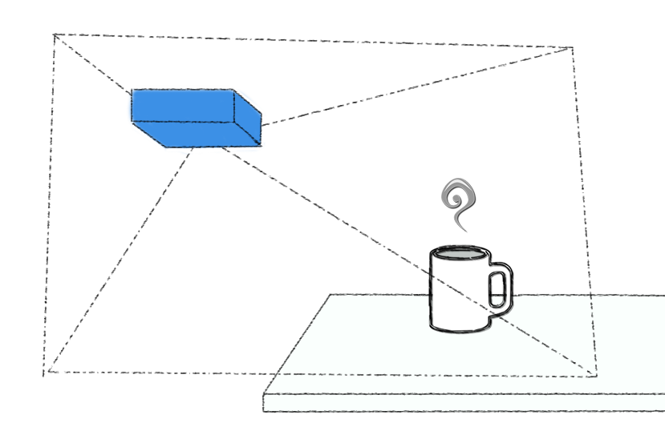
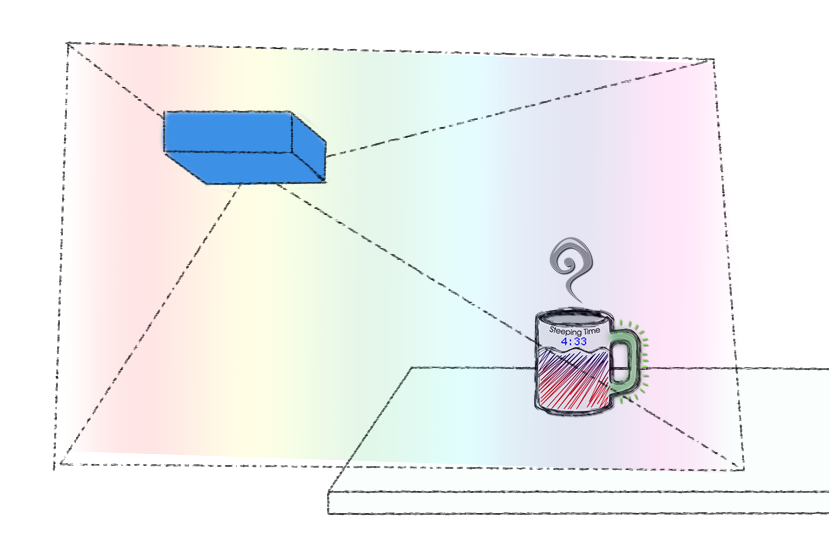
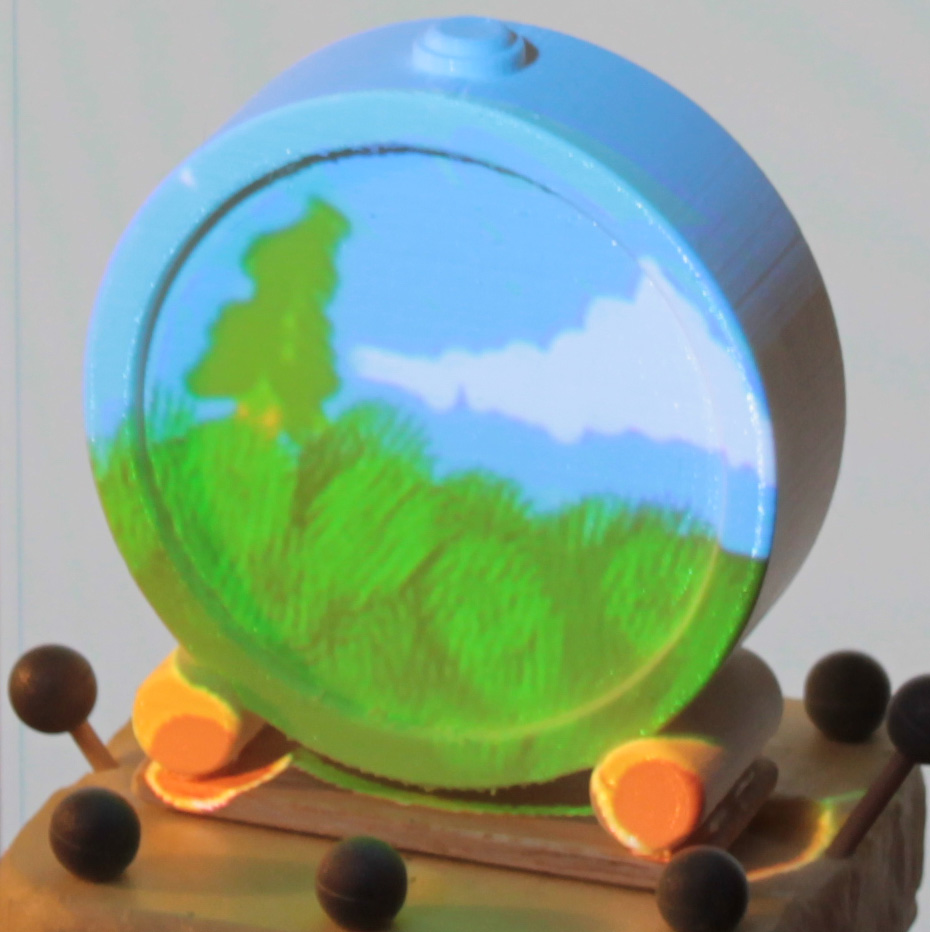
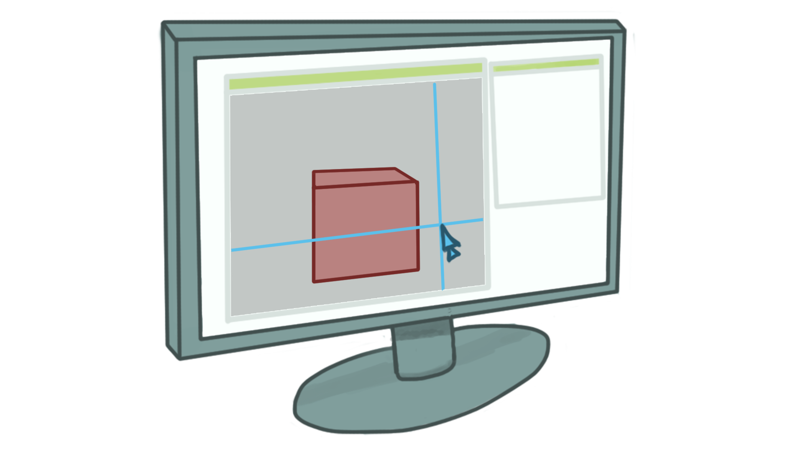

% 
% 
% Interaction and Introspection with Tangible Augmented Objects

# {data-background="./img/title.jpg"}

## {data-background="./img/screen-wonderland.png"}

## {data-background="./img/screen-prisoners.png"}

# What is SAR?

---

## 
*Spatial* Augmented Reality

---

### Augmented Reality

- Let's start with augmented reality
- AR = combining real and virtual
- For example, we can augment a normal mug with different functions:
    + Displaying remaining steeping time
    + Displaying temperature of liquid inside
    + Handle turns green when everything is OK

---

<!-- Video see-through -->
### Video see-through

- Traditional way is to use video see-through
- Can also uses head mounted display
- However: requires hardware for user

---

##
Uses projectors or screens in the environments to display information *spatially related* to this environment

- SAR instead uses projector or screens *in the environment*

<!-- SAR -->
## {data-transition="fade"}
### Spatial AR

- Example mug from before
- Normal mug + projector...

## {data-transition="fade"}
### Spatial AR 

- Creates augmented mug

# Applications

---

### Projection Mapping

<!-- Taken from https://en.wikipedia.org/wiki/Projection_mapping#/media/File:Vivid_Sydney_-_Opera_House_sails_(9002375891).jpg -->

<small>Source: The Sydney Opera House during the 2013 Vivid Sydney projection display</small>
 

- SAR is most known as a medium used to create impressive multimedia events
- e.g. when projecting on buildings

---

### Augmented Objects

- It can also be used to create augmented objects
- In these two pictures, *white* physical objects

# What is it good for?

---

### Pros
- User is free
- Scales well 
- Collaboration 
- Focus on *reality* 

---

### Cons
- Projection surface
- *Interaction*

# Interaction

---

### 
How to interact with digital information hosted on physical objects?

---

### Direct Touch
- "Natural"
- Anchored in reality

---

### But...
- What if object is...
    + Complex
    + Fragile
    + Distant
- Fat finger problem
- Tiring for long stretches of time

- Complex: with complex topology where you cannot touch everywhere (e.g. concave)
- Fragile: e.g. museum

---

### Indirect methods
We considered using standard 2D pointing devices such as a *mouse* or a *graphics tablet*

---

### Indirect methods
- Good for prolonged work
- Precise
- Allow for *hybrid* applications

# Pointing in SAR

## {data-transition="fade"}
### Standard way of pointing

Now what happens if...

## {data-transition="fade"}
### Removing the screen

Does pointing still works without a screen?

## {data-background="./img/cursar-teaser.jpg"}

# Study

---

### Questions
Differences between *SCREEN* and *SAR* conditions for pointing?

Does pointing in SAR follows Fitts' law?

---

### Apparatus

---

### 

- A: Circle-shaped cursor that follows the geometry of the real world
- B: Plane onto which cursor is mapped
    + In SAR, plane is virtual
    + In SCREEN condition, we use a wooden panel to create a screen there
- C: Guide displayed on the table to help know where the cursor is located
- D: Position of the user is known
- E: Projector
    + Augment real cube in SAR condition
    + Projects a virtual cube in SCREEN condition

---

### SCREEN vs SAR

- Comparison of the view in both conditions
- The view of the cube is the same
    + In SCREEN condition, note the virtual table is aligned with real table

---

### Scene

- Scene was changing between trials
- Cube alone in different orientation
- Cube *and* a more complex shape

---

### Procedures
<video data-autoplay class="stretch" src="./img/video.mp4"></video>

1. Position cursor in starting zone
1. Zone changes from red to green
1. Target appears
1. User go click on target
1. Comes back to starting zone

---

### Participants
>- 16 participants
>- Familiar with mice
>- Little experience with graphics tablets
>- No experience with SAR systems

---

### Design
>- Independent variables
    + Output
        * SCREEN
        * SAR
    + Input
        * MOUSE
        * TABLET

---

### Design
>- Dependent variables
    + Completion time
    + Inefficiency
    + Number of errors

- Inefficiency: deviation from the most optimal path

# Results

---

### Time 
Users were *11% faster* using a screen vs SAR

- Screen faster than SAR by 11%
- Drop of performance not so important: still usable
- Screen probably provide context for interaction
- No dead spaces in midair for SCREEN condition

---

### Inefficiency

- Input modality significant effect.
- Tablet is *less* efficient than mouse
- Explained by experience with mice vs graphics tablet
- See heatmap figure to show example of this

---

### Fitts law

- We modeled the movement time with a linear regression.
- Pointing task in SAR for both mice and tablets still follows Fitts' law and remain predictable
- Slower in SAR than SCREEN

Note: $R^2=0.8479$

# What's next?

- More work required to test these hypotheses
- Moreover... (applications)

---

### Professional applications

- Since it is possible to use 2D pointing devices in SAR w/o screen, opens possibility for professional applications that require precision for long stretches of time

---

### Different cursors
>- Perspective$^1$
>- Ubiquitous$^2$
>- Object-centric

<small>1: Nacenta et al. *"Perspective Cursor: Perspective-based Interaction for Multi-display Environments"*</small>
<small>2: Xiao et al. *"Ubiquitous cursor: a comparison of direct and indirect pointing feedback in multi-display environments"*</small>

---

### Hybrid workspaces

- Opens up possibility for truly hybrid applications
- Mixes desktop + reality around workspace

---

## {data-background="./img/cursar-teaser-drawing.jpg"}

- For example, working on a traditional screen and being able to point at objects on the *physical desk* seamlessly

---

## {data-background="./img/tangible-viewport.jpg"}

- We continued our investigation varying the different way to leverage the screen context
- Here, we keep the screen context for interaction and interact with a physical object when it is located *in front of the screen*

## Thank You {data-background="./img/logos.png"}
renaudgervais.github.io

<small>These slides are available online at   renaudgervais.github.io/presentations</small>

# 

---

### Results
