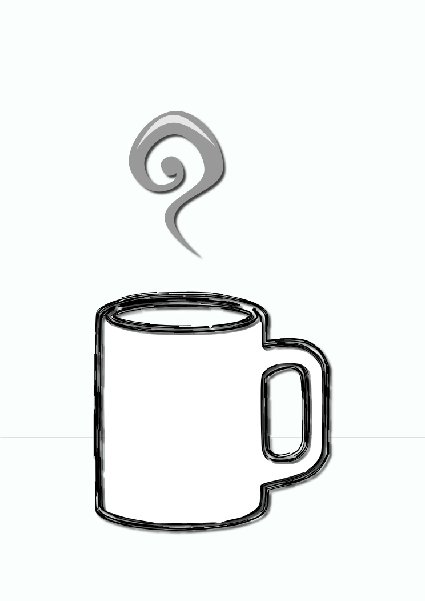
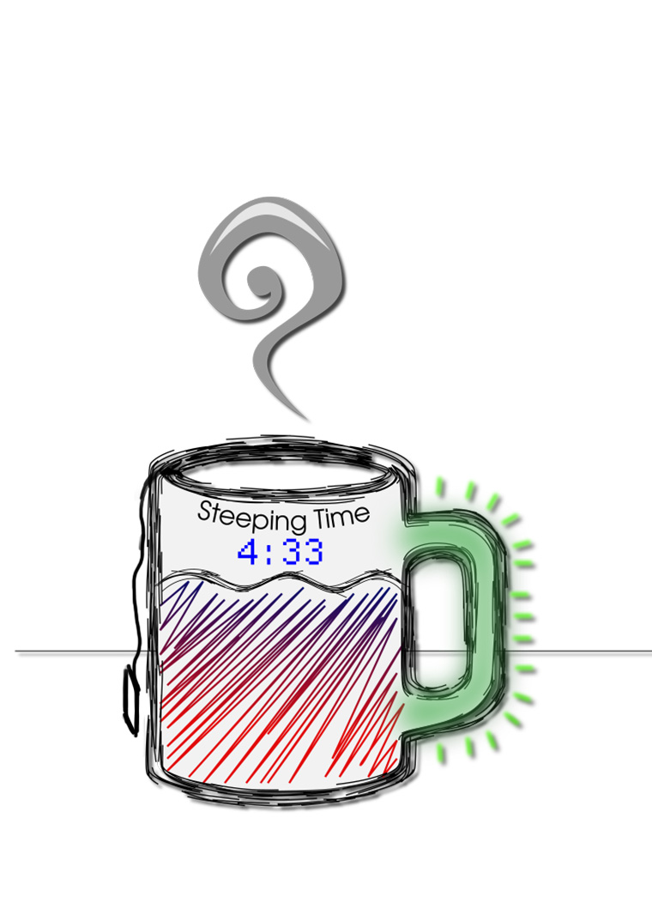
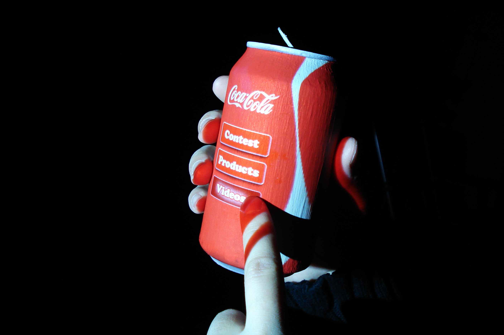
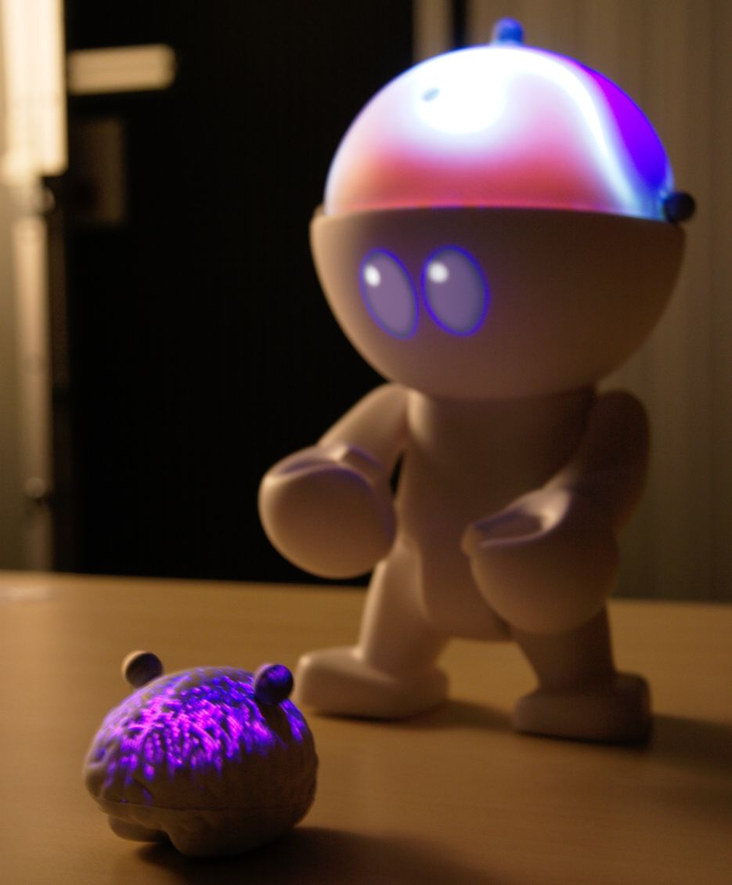
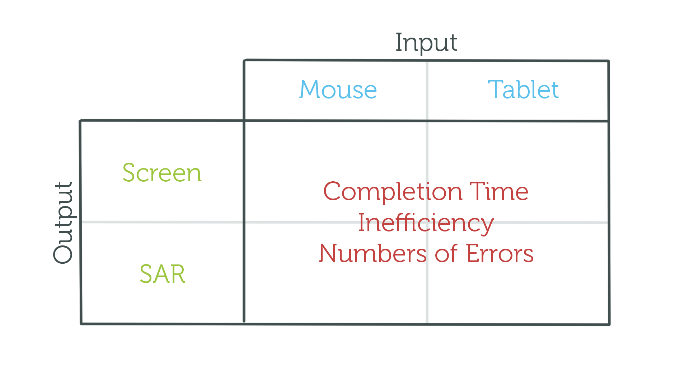
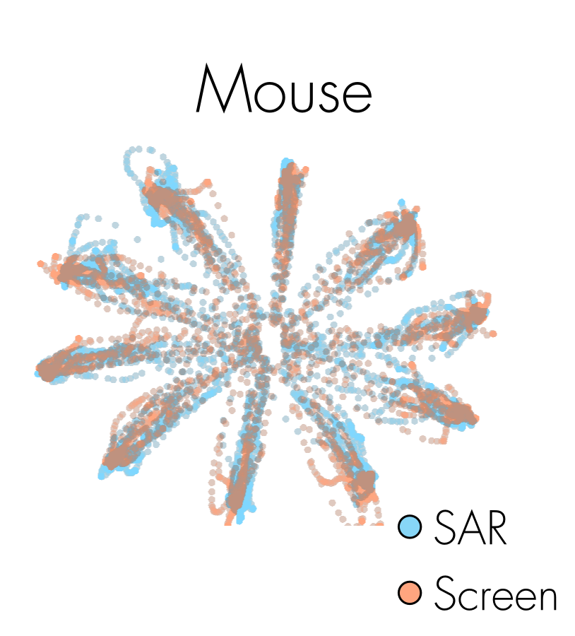
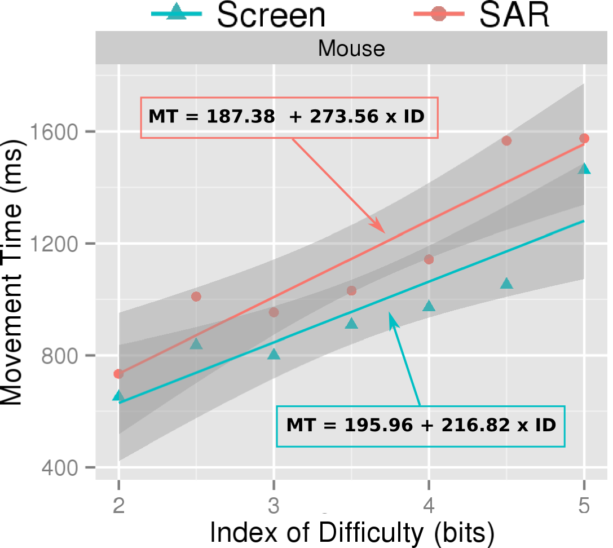
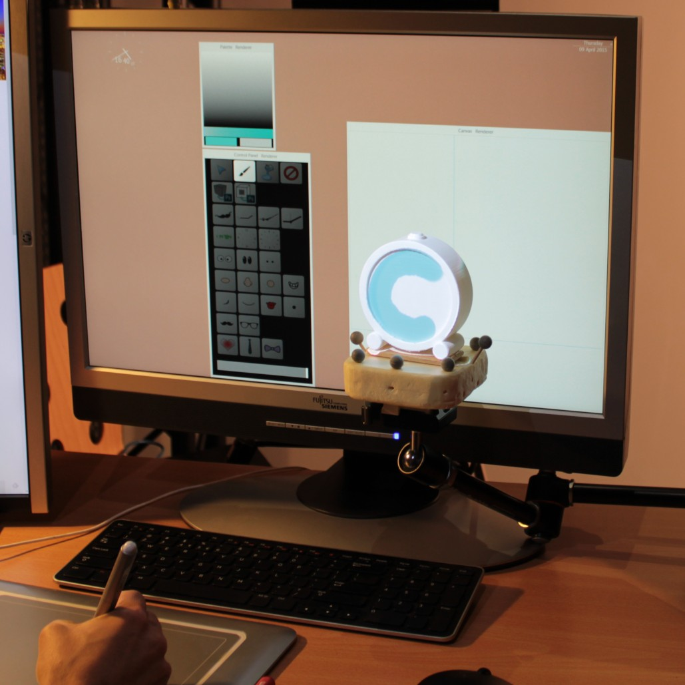
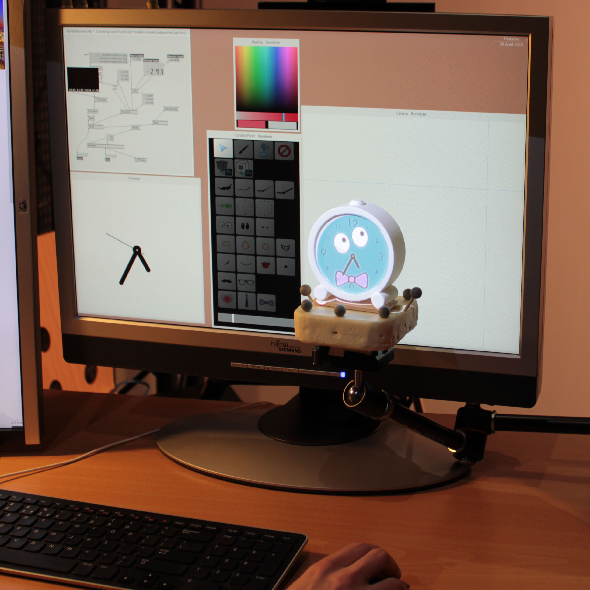

% 
% 
% Interaction and Introspection with Tangible Augmented Objects

# {data-background="./img/title.jpg"}

## {data-background="./img/screen-wonderland.png"}

- Digital wonderland at fingers' reach

## {data-background="./img/screen-prisoners.png"}

- But cannot touch it

---

### A **Humane** Representation of Thought

- Technology constrain our bodies
- Only eye and fingers working
- Bodies have been neglected
- Tip of finger interaction is limiting. Not humane.
- Evolution made it so that we think *with all our senses*

<!-- Attention -->
## {data-background="./img/sur-fake-5-crop.jpg"}

- Devices became portable
- But require our whole attention
- Either IN the screen our OUT in the world

               

Source: Antoine Geiger's SUR-FAKE

---

### Real World
We **know** how it works 

## {data-transition="fade"}

## {data-transition="fade"}

---

## Augmented Objects

- For example, we can augment a normal mug with different functions:
    + Displaying remaining steeping time
    + Displaying temperature of liquid inside
    + Handle turns green when everything is OK

---

### Interaction
How can we *interact* with digital content hosted on physical objects?

<!-- Contribution on interaction -->
## {data-background="./img/cursar-teaser.png"}

The evaluation of the use of 2D pointing devices – mouse and
graphics tablet – in a pointing task in a SAR context compared
to a screen condition.

## {data-background="./img/tports-video-teaser.png"}

The design, implementation and evaluation of a system enabling
the interaction between a typical desktop computer environ-
ment – traditional screens, mouse and keyboard – with tangible
augmented objects, considering an object design scenario as a
main thread.

---

### Introspection
How can we use augmented objects to reveal hidden information about *our own selves*?

## {data-background="./img/teegi-teaser.jpg"}

## {data-background="./img/tobe-coherence.jpg"}

<!-- Related work -->
# Context

---

### Related Areas
- Ubiquitous Computing & Calm Technologies
- Physiological & Affective Computing
- Tangible User Interfaces
- Augmented Reality

---

### Ubicomp & Calm Technologies

---

### Physiological & Affective Computing

---

### Tangible User Interfaces

---

### Organic User Interfaces

---

### Augmented Reality

---

### Video see-through

- Traditional way is to use video see-through
- Can also uses head mounted display
- However: requires hardware for user

---

### *Spatial* Augmented Reality
Uses projectors or screens *in the environments* to display information spatially related to this environment

- SAR instead uses projector or screens *in the environment*
- Link with Ubicomp

<!-- SAR -->
## {data-transition="fade"}

- Example mug from before
- Normal mug + projector...

## {data-transition="fade"}

- Creates augmented mug

---

### Projection Mapping

<!-- Taken from https://en.wikipedia.org/wiki/Projection_mapping#/media/File:Vivid_Sydney_-_Opera_House_sails_(9002375891).jpg -->

<small>Source: The Sydney Opera House during the 2013 Vivid Sydney projection display</small>
 

- SAR is most known as a medium used to create impressive multimedia events
- e.g. when projecting on buildings

---

### Augmented Objects

- It can also be used to create augmented objects
- In these two pictures, *white* physical objects

---

### How does it work?

<!-- TODO: Declutter images -->
## {data-background="./img/sar-pipeline.png"}

<!-- TODO: Declutter images -->
## {data-background="./img/sar-pipeline-virtual.png"}

---

### What is it good for?

---

### Pros
- Anchored in the *real world*
- User is free
- Scales well 
- Collaboration 

---

### Cons
- Projection surface
- Shadows
- Complexity
- *Interaction*

Complexity: Calibration with multiple devices (esp. /w multi-proj setup)

# Interaction

## {data-background="./img/cursar-teaser.png"}

- We focus on the creation of *hybrid environments*
- Desktop computers are still good platforms for content creation

---

### Indirect pointing methods
Using standard 2D pointing devices such as a *mouse* or a *graphics tablet*

---

### Indirect pointing methods
- Good for prolonged work
- Precise
- Allow for *hybrid* applications
- Works with objects that are:
    + Complex
    + Fragile
    + Distant

<!--
---

### Direct Touch
- "Natural"
- Anchored in reality

---

### But...
- What if object is...
    + Complex
    + Fragile
    + Distant
- Fat finger problem
- Tiring for long stretches of time

- Complex: with complex topology where you cannot touch everywhere (e.g. concave)
- Fragile: e.g. museum

-->

# Pointing in SAR

## {data-transition="fade"}
### Standard way of pointing

Now what happens if...

## {data-transition="fade"}
### Removing the screen

Does pointing still works without a screen?

## Study

---

### Questions
Differences between *SCREEN* and *SAR* conditions for pointing?

Does pointing in SAR follows Fitts' law?

## {data-transition="fade"}
### Pointing technique

## {data-transition="fade"}
### Pointing technique

---

### Apparatus

- A: Circle-shaped cursor that follows the geometry of the real world
- B: Plane onto which cursor is mapped
    + In SAR, plane is virtual
    + In SCREEN condition, we use a wooden panel to create a screen there
- C: Guide displayed on the table to help know where the cursor is located
- D: Position of the user is known
- E: Projector
    + Augment real cube in SAR condition
    + Projects a virtual cube in SCREEN condition

---

### SCREEN vs SAR

- Comparison of the view in both conditions
- The view of the cube is the same
    + In SCREEN condition, note the virtual table is aligned with real table

---

### Scene

- Scene was changing between trials
- Cube alone in different orientation
- Cube *and* a more complex shape

---

### Procedures
<video data-autoplay controls class="stretch" src="./img/video.mp4"></video>

1. Position cursor in starting zone
1. Zone changes from red to green
1. Target appears
1. User go click on target
1. Comes back to starting zone

---

### Participants
>- 16 participants
>- Familiar with mice
>- Little experience with graphics tablets
>- No experience with SAR systems

---

### Design

- Inefficiency: deviation from the most optimal path

## Results

---

### Time 
Users were *11% faster* using a screen vs SAR

- Screen faster than SAR by 11%
- Drop of performance not so important: still usable
- Screen probably provide context for interaction
- No dead spaces in midair for SCREEN condition

---

### Inefficiency

- Input modality significant effect.
- Tablet is *less* efficient than mouse
- Explained by experience with mice vs graphics tablet
- See heatmap figure to show example of this

---

### Fitts law

- We modeled the movement time with a linear regression.
- Pointing task in SAR for both mice and tablets still follows Fitts' law and remain predictable
- Slower in SAR than SCREEN
- More XP to evaluate learning effect

Note: $R^2=0.8479$

## {data-background="./img/cursar-teaser.png"}
### Hybrid workspaces

- Opens up possibility for truly hybrid applications
- Mixes desktop + reality around workspace

---

# Tangible Viewports

## {data-background="./img/tports-video-teaser.png" data-transition="fade"}

- We continued our investigation varying the different way to leverage the screen context
- Here, we keep the screen context for interaction and interact with a physical object when it is located *in front of the screen*

## {data-background="./img/tports-video-teaser-highlight.png" data-transition="fade"}

- Focus on hybrid environment

## 
<video controls src="./img/tports.mp4"></video>

---

### Metaphor

Working on a physical object becomes the same thing as working on a virtual version in a window

---

### Pointing technique

- Same as with CurSAR
- Screen is tracked
- Behavior of cursor is coherent only for operator
- Cursor is visible by *everyone*

---

## Applications

---

### Painting

---

### Programming Augmented Objects

---

### Objects in Sync

## {data-background="./img/tports-video-teaser-bounded.png"}

## {data-background="./img/tports-video-teaser-unbounded.png"}

# Thank You {data-background="./img/logos.png"}
renaudgervais.github.io

<small>These slides are available online at   renaudgervais.github.io/presentations</small>

# 

---

### Results
